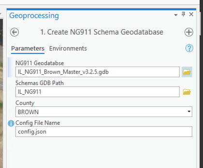
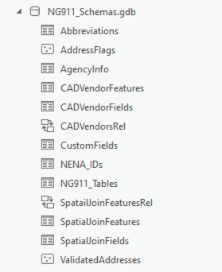

-   [Administrator
    Setup](#administrator-setup){#toc-administrator-setup}
    -   [Run the `1. Create NG911 Schema Geodatabase`
        Tool](#run-the-1.-create-ng911-schema-geodatabase-tool){#toc-run-the-1.-create-ng911-schema-geodatabase-tool}
    -   [Create Schemas Tool
        (Optional)](#create-schemas-tool-optional){#toc-create-schemas-tool-optional}
    -   [Create Custom fields
        (Optional)](#create-custom-fields-optional){#toc-create-custom-fields-optional}
    -   [Create CAD Vendor Fields
        (Optional)](#create-cad-vendor-fields-optional){#toc-create-cad-vendor-fields-optional}
-   [Setup ArcGIS Pro
    Document](#setup-arcgis-pro-document){#toc-setup-arcgis-pro-document}
    -   [Setup ArcGIS Pro
        Task](#setup-arcgis-pro-task){#toc-setup-arcgis-pro-task}

## Administrator Setup

Before the tools are ready to be used, a configuration step is necessary
to register the data paths for tools so they know where to find the 911
data. This is done to remove redundancy of making the end user have to
select the data sources for each operation. There is an [Administrator
Toolbox](./Administrator/NG911_AdminTools.pyt) to assist with this task:

### Run the `1. Create NG911 Schema Geodatabase` Tool

This tool is required to be ran before using any of the NextGen 911
tools. This tool will register all the necessary data paths by creating
a new Geodatabase called `NG911_Schemas.gdb`. First, set the first
parameter `NG911 Geodatabase` to point to your NextGen911 Geodatabase.
Next point the `Schemas GDB Path` to either a shared network folder
location location where it will create the `NG911_Schemas.gdb`
geodatabase to store the registry of layers, address flags, custom
fields and other information. This parameter can also point to an
existing SDE Geodatabse (recomended name of `NG911_Scheamas`). Next, set
the `County` to the appropriate county name:

> Note: for multi-user editing scenarios it is **strongly recommended**
> to set the `Schemas GDB Path` parameter to an existing SDE Geodatabase
> rather than a folder location. When the parameter is a folder
> location, a File Geodatabase will get created there and will acquire
> schema locks when one user is accessing these tools.

This tool should take a couple minutes to run and when complete should
create a Geodatabase that looks like this:

You'll notice that this tool creates several tables, with the most
important being the `NG911_Tables`. Open this table in ArcGIS Pro to
review the contents:

> Note: if you do not see records in this table pointing to the 911
> Tables, you will need to run the [Create NG911 Schema Tables
> (Optional)]() tool

Here is a breakdown of all the tables: - `Abrreviations` - a registry of
any custsom abbreviations you want to used - `AddressFlags` - a point
feature class that will be used to show the locations of any flagged
address. Addresses get flagged when there are issues found during the
validation process. - `AgencyInfo` - this stores the agency info, namely
the county and the agency identifier that is used for setting all `NENA`
identifiers

### Create Schemas Tool (Optional)

This tool only needs to be ran if the `NG911_Tables` has empty records
after running the `Create NG911 Schema Geodatabase` tool. This tool will
allow you to manually register the 911 layers with the schemas database.
You can also update the `NENA` prefixes per feature type:

### Create Custom fields (Optional)

These tools also include the ability to populate custom fields based on
expressions when creating new 911 features. The `Create Custom Fields`
tool can be used to store the expressions along with their corresponding
fields. An expression can be defined using plain text and field tokens,
where the field name is contained within curly braces `{FieldName}`.

#### creating an expression

Custom expressions can be created by combining plain text and field
tokens. The field tokens must be fields contained within the database
table. The fields are calculated after the new point has been created
and all other attributes have been pulled over from the street
centerlines data.

In the following example, we will define two custom field expressions as
shown below:

In this example, two fields are being calculated:

-   `GC_ADDRESS_wZIP` - a concatenation of the address and zip code
    -   the expression `{Add_Number} {St_Name} {St_PosTyp} {Post_Code}`
        is concatenating the `Add_Number`, `St_Name`, `St_PosTyp`, and
        `{Post_Code}`.

    -   This forms a value that looks like: `"142 MAIN STREET 62353"`
-   `GC_Address_wMSAGCOMM` - concatenation of the address and MSAG
    community name
    -   this concatenates the same address fields, but the `MSAGComm`
        field instead of `Post_Code`
    -   This forms a value that looks like:
        `"142 MAIN STREET MOUNT STERLING"`

This tool will also take care of trimming any extra white space between
and around words. It is also possible to combine plain text with the
field names. An example would be to calculate the address range for a
segment in the `Road Centerlines`. Setting an expression of
`{FromAddr_L} to {ToAddr_L}` should yeild a value like `100 to 142`.

#### special convenience tokens

Aside from the available field tokens based on the schema, there are
also some convenience tokens that can be used:

-   `PreDirectionAbbr` - prefix direction abbreviation (ex: `NORTHEAST`
    -\> `NE`, `SOUTH` -\> `S`, etc)
-   `PostDirectionAbbr` - prefix direction abbreviation (ex: `NORTHEAST`
    -\> `NE`, `SOUTH` -\> `S`, etc)

### Create CAD Vendor Fields (Optional)

This tool is very similar to the `Create Custom Fields` tools, excpet
these also register a `CAD Vendor` for each custom field.

There is also a tool to add `PreConfigured CAD Vendor` fields based on a
given vendor. For this, simply point to the feature type and select a
pre-configured vendor from the list. This tool will take care of adding
any necessary fields and registering the custom expressions.

## Setup ArcGIS Pro Document

The 911 Data Champion/Administrator for the county should set up a
shared ArcGIS Pro Project that is available to all editors. This is
beneficial for many reasons, namely having the necessary data displayed
consistently in one spot, the toolbox folders can be saved within the
project, and an ArcGIS Pro Task can be set up to assist with the
creation of new Address Points. At minimum, the map should include *Road
Centerlines*, *Address Points*, and a good aerial image.

### Setup ArcGIS Pro Task

It is strongly recommended to set up an ArcGIS Pro task to streamline
the Address Point creation team. The Address Point tool is designed to
grab attributes from a selected Road Centerline, so the task can string
this process ahead of running the `Create Address Point` tool.

1.  Click on the `View` tab in ArcGIS Pro and hit the `Tasks` Ribbon.
    This should open the Task Designer in the right content pane.

2.  Click `New Task Item`. Give it a name of `Create Address Point`
    under the `General` Tab. 

3.  Under the `Tasks` content menu, hit the `New Task` button and name
    it `Select Road Centerline` and give it a description. Be sure to
    set this as a `Manual` step.\
    
    

4.  Under `Actions` inside the `Select Road Centerline` Task, click on
    the red `Record` button. This will record an action we do and this
    task will take that action. The action we want to record is to use
    the `Rectange Select` tool that is found under the `Map` Tab in
    ArcGIS Pro. While in record mode, hit the `Select` button and select
    a single `Road Centerline` segment. This action will get recoreded.

5.  Next, we want to customize this behavior a bit. Before our
    selection, we want to make sure we are starting with an empty
    selection so under `Additional Actions`, hit the `Add Action` button
    under `When starting the step` and set that to `Clear Selection`.

-   Because we only want to select one road centerline, we should also
    add an action `When exciting the step` set to `Verification`.
    -   This will open up an interface where we can set the
        `Verify number of features or records in` to
        `Features or records currently selected` in the drop down.
    -   set the `in table` dropdown to the *Road Centerline* layer (this
        may be named differently in your map)
    -   set the `meets condition` dropdown to `Equal to` with a value of
        `1` to ensure we only have one selected road.
    -   add a help message at the bottom. When finished verify it looks
        something like this:
        
-   hit `Done` to return to the task.

6.  Under `Contents` make sure the \*Road Centerline\` is the only
    selectable layer for this task
    
7.  Navigate back to the `Tasks` tab and hit the `New Step` button. Now
    we will just add a step run our Address Creation tool. Name this
    step `Run Create Address Point Tool`, set some instructions and set
    the behavior to `Manual`.

 8. Under
`Actions`, hit the record button and once recording open the
`NextGen911_Tools.pyt` and hit the `Create Address Point` tool inside
the `Create Features` toolset:

9.  Once the tool dialog opens you don't need to do anything. Switch
    back into the task editor and click the edit button next to the
    `Create Address Point` action:

\[task-9b\](/resources/images/task-09b-preset-params.png

10. This should open the tool dialog. The only thing we need to do here
    is select your Roads Centerline data from the `Roads Layer`
    dropdown. Hit `Done` when it is selected:

11. The last thing to do is add another action for
    `When exiting the step` to `Clear Selection` so that once the task
    is finished it will clear the selection. Hit `Done`.

12. The task summary should look like this:

13. That is all for the task setup. **Be sure to save the Pro document
    to save the task changes**. This task is now ready to be ran once
    you close the `Task Designer` pane.
