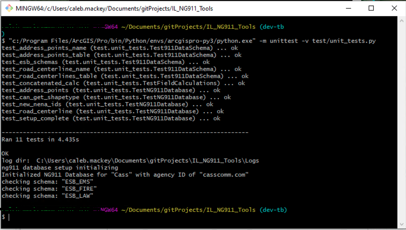

# Illinois Next Gen 911 Tools

-   [Illinois Next Gen 911 Tools](#ilng911)
    -   [Installation](#installation)
        -   [method 1 - use download
            script](#method-1---use-download-script)
        -   [method 2 - git
            (advanced)](#method-2---git-advanced)
    -   [Administrator
        Setup](#administrator-setup)
    -   [Running the NG911
        Tools](#running-the-ng911-tools)
        -   [Running the `Create Address Point` ArcGIS Pro
            Task](#running-the-create-address-point-arcgis-pro-task)
    - [Encountering Issues with tools](#encountering-errors-with-these-tools)
    - [Issues and Enhancements](#issues-and-enhancements)
    - [Running the tests](#running-the-tests)


The `ilng911` package contains NextGen 911 Tools for Illinois Counties. This has
been designed to run in ArcGIS Pro and tools are provided through a
[Python
Toolbox](https://pro.arcgis.com/en/pro-app/2.8/arcpy/geoprocessing_and_python/a-quick-tour-of-python-toolboxes.htm).

These tools assume there is a Geodatabase that conforms to the specific
NextGen 911 schemas as outlined in the [required layers
resource](./resources/NG911%20Required%20Data%20Layers_ltr.pdf):


Before these tools can get used, there is a preconfiguration step that
needs to be set up by the 911 GIS Data Administrator. It is also
**strongly recommended** to create a shared ArcGIS Pro Project that can
be used to input new addresses.

## Installation

It is strongly recommended to install
[git](https://git-scm.com/downloads) on to be able to work with the
source code from the
[Github](https://github.com/CalebM1987/IL_NG911_Tools) repo. By using
`git`, that will also make it easier to get the updated code for these
tools when bugs are fixed or enhancements are added. Any bugs that get
fixed or new features will be displayed in the
[Changelog](./CHANGELOG.md).

Once you have `git` installed on your machine, the tools can be
installed. **These tools should be installed on a shared network drive
where the tools are accesible both to the end user who will perform
address updates and the administrator**.

### method 1 - use download script

Navigate to a shared directory where these tools will be ran from. Copy
the contents from the [download script](./download_from_git.py) to your
clipboard. Inside the target folder, create a new file called
`download_from_git.py` (make sure the file extensions are not hidden).
Open this file in an IDE or notepad and paste the code you copied
earlier and save the document. You should be able to close the file and
run it by double clicking it. After the script runs, it should have
created a folder called `IL_NG911_Tools` which contains everything in
this repo.

### method 2 - git (advanced)

open a `bash` command propmpt and cd to the shared network (it may be
easier to just right click inside the folder context and hit
`Open GitBash Here`). Enter the following commands:

``` sh
# cd to network shared folder, where it is accesible to all users
cd //your-server/GIS/ng911 

# once inside your shared network folder, clone the git repo
git clone git@github.com:CalebM1987/IL_NG911_Tools.git
```

This will install the tools in a folder called `IL_NG911_Tools` into
whatever folder you ran the bash script from.

> Note: It is very important not to alter the folder structure of this
> package. **Moving any files around will likely break the tools**.

## Administrator Setup

The 911 GIS Data Administrator should follow the steps on the
[Administrator Help Page](./Administrator.md) to set up the
configuration database, ArcGIS Pro Document, and the Pro Tasks to
streamline the 911 Tools. It is also strongly recommended that the
administrator set up a shared ArcGIS Pro project that contains all the
necessary layers and a custom ArcGIS Pro task to assist with the address
point creation workflow.

## Running the NG911 Tools

Once the administrator has downloaded the tools and set up the Address
Point task, the tools are ready to be ran by the end users. Inside the
`Toolbox` folder, you should see a `NextGen911_Tools.pyt` which is a
Python Toolbox.


This contains the following toolsets:

-   `Create Features`
    -   `Create Address Point` - this tool should not be ran directly,
        as it will be implemented as part of the ArcGIS Pro task setup
        by the administrator. But should you run it manually, it will
        create a new address point based on a user defined point
        location and a selected road segment (used to pull street
        attributes).
-   `Validation`
    -   `Run Address Validation` - will run a validation check against
        all addresses in the database. This step may not be necessary
        due to the tools already created by esri, but it does provide
        additional checks to flag address with validation errors.

### Running the `Create Address Point` ArcGIS Pro Task

The `Create Address Point` task was designed to simplify the workflow of
adding new address points. In your ArcGIS Pro project, open the
`Catalog` Pane and inside the `Tasks` folder, double click on the
`Create Address Point` task to start it:


You should see something like the screenshot below. Click `Run` at the
bottom of the pane to start it: 

The first thing it should do is have you select a single road centerline
with the rectangle tool:


Once you have selected **one single road**, hit `Next Step` to advance
to the point creation tool. To set the new point location click on the
pencil icon next to the `Draw Point` parameter (do not worry about
clicking anything from the drop down). This will initiate the sketch
tool and will turn the mouse to a crosshair when hovering over the map.
You can simply click on the map where you want the point to be:


The next important piece is to add the `Address Number`. The tool should
warn you if you if you are entering an address that has incorrect parity
or is out of range:


Use your own descretion to fill in any additional field value
parameters. Keep in mind, the street related attributes are excluded
because they will get automatically populated from the selected road
centerline. This is done to make the process more efficient and reduce
the possibility of human error, thus the main source of truth will
always be the street centerlines. As long as that data is correct and
accurate, valid address attributes will be auto populated.

Additionally, if there are any "extra" custom fields outside of the base
911 schema that need to be auto populated based on the attribute data,
your administrator should have registered those custom fields. Those
custom fields will also be excluded from the field parameter lists and
will get populated when the new point is created from this tool.

Once you have entered all the necessary information (in most cases it
should just be the `Address Number`) hit the `Run` button to create the
new address point. Once the tool has finished running, you should see a
success message at the bottom. Hit `Finish` to dismiss the task:


If you want to view the tool messages and logs, you can click on the
`View Details` button, but it is not necessary. Viewing the details
should look something like this:


#### encountering errors with these tools

If you encounter issues with these tools, please [submit an issue to the
GitHub repo](https://github.com/CalebM1987/IL_NG911_Tools/issues/new)
and provide as much detail as possible. This will help improve the tools
because the bugs can be easily tracked and fixed with Github.

> Note: Each time a tool runs, a log file will also be created in the
> `Logs` folder inside the `IL_NG911_Tools` folder. It may be useful to
> include the log file when submitting the issue.


### Issues and Enhancements

if you run into an issue running these tools, please be sure to submit an issue to the GitHub page. Include as much information as you can including any error messages as that makes it easier to fix bugs.

### running the tests

Once setup has been completed, it is important to run the unit tests to make sure everything is working. To run the tests, open `Git Bash` in the folder for these tools and run the following command in the terminal (right click and paste):

```sh
"c:/Program Files/ArcGIS/Pro/bin/Python/envs/arcgispro-py3/python.exe" -m unittest -v test/unit_tests.py
```

If all is well, the tests should all pass:
