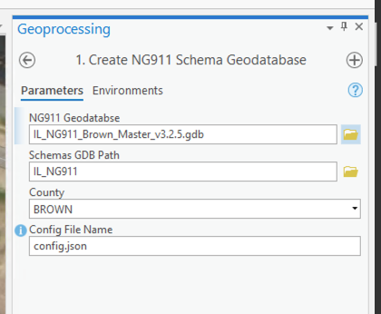

# ilng911 

This package contains NextGen 911 Tools for Illinois Counties. This has been designed to run in ArcGIS Pro and tools are provided through a [Python Toolbox](https://pro.arcgis.com/en/pro-app/2.8/arcpy/geoprocessing_and_python/a-quick-tour-of-python-toolboxes.htm).  

These tools assume there is a Geodatabase that conforms to the specific NextGen 911 schemas as outlined in the [required layers resource](./resources/NG911%20Required%20Data%20Layers_ltr.pdf):


Before these tools can get used, there is a preconfiguration step that needs to be set up by the 911 GIS Data Administrator. It is also **strongly recommended** to create a shared ArcGIS Pro Project that can be used to input new addresses.

## Installation

The recommended way to install these tools is by using [git](https://git-scm.com/downloads) to install from the [Github](https://github.com/CalebM1987/IL_NG911_Tools) repo. By using `git`, that will also make it easier to get the updated code for these tools when bugs are fixed or enhancements are added. Any bugs that get fixed or new features will be displayed in the [Changelog](./CHANGELOG.md).

Once you have `git` installed on your machine, the tools can be installed. **These tools should be installed on a shared network drive where the tools are accesible both to the end user who will perform address updates and the administrator**. run this command in the `bash` command propmpt: 

```sh
# cd to network shared folder, where it is accesible to all users
cd //your-server/GIS/ng911 

# once inside your shared network folder, clone the git repo
git clone git@github.com:CalebM1987/IL_NG911_Tools.git
```

This will install the tools in a folder called `IL_NG911_Tools` into whatever folder you ran the bash script from.

> Note: It is very important not to alter the folder structure of this package. **Moving any files around will likely break the tools**.
## Administrator Setup

Before the tools are ready to be used, a configuration step is necessary to register the data paths for tools so they know where to find the 911 data. This is done to remove redundancy of making the end user have to select the data sources for each operation. There is an [Administrator Toolbox](./Administrator/NG911_AdminTools.pyt) to assist with this task:


### Run the `1. Create NG911 Schema Geodatabase` Tool

This tool is required to be ran before using any of the NextGen 911 tools. This tool will register all the necessary data paths by creating a new Geodatabase called `NG911_Schemas.gdb`. First, set the first parameter `NG911 Geodatabase` to point to your NextGen911 Geodatabase. Next point the `Schemas GDB Path` to a shared network location where it will create the `NG911_Schemas.gdb` geodatabase to store the registry of layers, address flags, custom fields and other information.  Next, set the `County` to the appropriate county name:



This tool should take a couple minutes to run and when complete should create a Geodatabase that looks like this:


You'll notice that this tool creates several tables, with the most important being the `NG911_Tables`. Open this table in ArcGIS Pro to review the contents:


> Note: if you do not see records in this table pointing to the 911 Tables, you will need to run the [Create NG911 Schema Tables (Optional)]() tool

Here is a breakdown of all the tables:
    * `Abrreviations` - a registry of any custsom abbreviations you want to used
    * `AddressFlags` - a point feature class that will be used to show the locations of any flagged address.  Addresses get flagged when there are issues found during the validation process.
    * `AgencyInfo` - this stores the agency info, namely the county and the agency identifier that is used for setting all `NENA` identifiers

#### Create Schemas Tool (Optional)

#### Create Custom fields (Optional)

#### Create CAD Vendor Fields (Optional)

## Setup ArcGIS Pro Document

The 911 Data Champion/Administrator for the county should set up a shared ArcGIS Pro Project that is available to all editors. This is beneficial for many reasons, namely having the necessary data displayed consistently in one spot, the toolbox folders can be saved within the project, and an ArcGIS Pro Task can be set up to assist with the creation of new Address Points.  At minimum, the map should include *Road Centerlines*, *Address Points*, and a good aerial image.

### Setup ArcGIS Pro Task

It is strongly recommended to set up an ArcGIS Pro task to streamline the Address Point creation team. The Address Point tool is designed to grab attributes from a selected Road Centerline, so the task can string this process ahead of running the `Create Address Point` tool.

  1. Click on the `View` tab in ArcGIS Pro and hit the `Tasks` Ribbon. This should open the Task Designer in the right content pane.
  
  2. Click `New Task Item`.  Give it a name of `Create Address Point` under the `General` Tab.
  
  3. Under the `Tasks` content menu, hit the `New Task` button and name it `Select Road Centerline` and give it a description. Be sure to set this as a `Manual` step.  
  
  
  
  4. Under `Actions` inside the `Select Road Centerline` Task, click on the red `Record` button. This will record an action we do and this task will take that action. The action we want to record is to use the `Rectange Select` tool that is found under the `Map` Tab in ArcGIS Pro. While in record mode, hit the `Select` button and select a single `Road Centerline` segment. This action will get recoreded.
  
  
  5. Next, we want to customize this behavior a bit. Before our selection, we want to make sure we are starting with an empty selection so under `Additional Actions`, hit the `Add Action` button under `When starting the step` and set that to `Clear Selection`. 
   
 - Because we only want to select one road centerline, we should also add an action `When exciting the step` set to `Verification`.  
   - This will open up an interface where we can set the `Verify number of features or records in` to `Features or records currently selected` in the drop down.
   - set the `in table` dropdown to the *Road Centerline* layer (this may be named differently in your map)
   - set the `meets condition` dropdown to `Equal to` with a value of `1` to ensure we only have one selected road.
   - add a help message at the bottom.  When finished verify it looks something like this: 
  
  - hit `Done` to return to the task.

  
  6. Under `Contents` make sure the *Road Centerline` is the only selectable layer for this task
  
  7. Navigate back to the `Tasks` tab and hit the `New Step` button. Now we will just add a step run our Address Creation tool. Name this step `Run Create Address Point Tool`, set some instructions and set the behavior to `Manual`.
  
  
  8. Under `Actions`, hit the record button and once recording open the `NextGen911_Tools.pyt` and hit the `Create Address Point` tool inside the `Create Features` toolset:
  9.  Add another action for `When exiting the step` to `Clear Selection` so that once the task is finished it will clear the selection. The summary should look like this:
  10.  That is all for the task setup. Be sure to save the Pro document to save the task changes. This task is now ready to be ran once you close the `Task Designer` pane.


